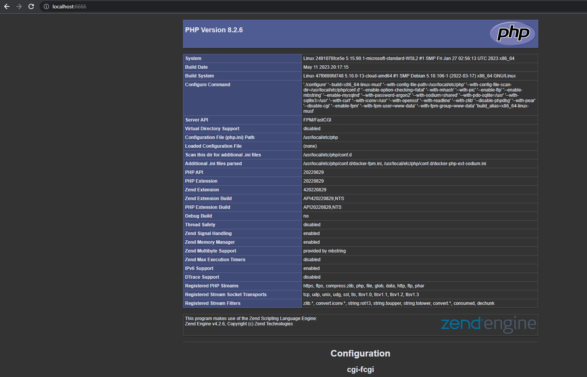

# Laboratorium_11

Paweł Jabłoniec

Sprawozdanie - laboratorium 11

---

### 1. Uruchomienie aplikacji

#### 1. Uruchomienie docker-compose

`docker compose up -d --build`

---

#### 2. Odblokowanie portu 6666 w przeglądarce

---

#### 3. Uruchomienie usług w przeglądarce na portach 6666 oraz 6001:

`http://localhost:6666/`

---

`http://localhost:6001/`

---

#### 4. Zatrzymanie oraz usunięcie kontenerów:

`docker compose down`

